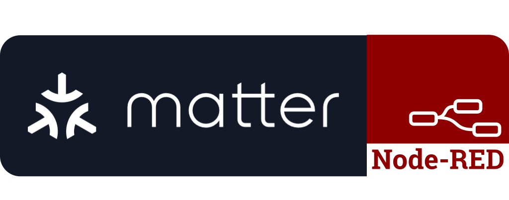
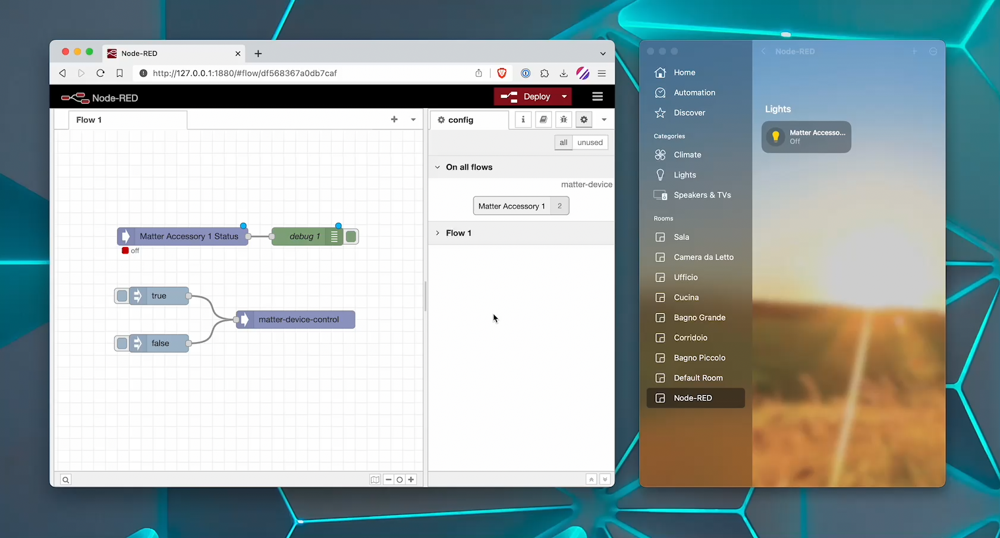

# Node-RED Matter Plugin

The Node-RED Matter plugin is an open-source project that enables the generation of Matter devices within Node-RED.
Matter devices created using this plugin can be seamlessly integrated into popular smart home controllers such as
Apple Home, Google Home, and Alexa. Additionally, you can control and retrieve data from these devices directly within Node-RED.

## Features

- Matter Device Generation: Generate Matter devices within Node-RED for easy integration with various smart home controllers.
- Controller Compatibility: Compatible with popular smart home controllers such as Apple Home, Google Home, and Alexa.
- Bi-Directional Communication: Control and read data from Matter devices directly within Node-RED.
- Flexibility: Customize and configure the behavior of Matter devices based on your specific requirements.
- Seamless Integration: Connect Matter devices to existing Node-RED flows effortlessly.

[](public/demo.mp4)

## Installation

To install the Node-RED Matter plugin, follow these steps:

1. Open your Node-RED installation.
2. Navigate to the root directory of your Node-RED installation (typically `~/.node-red`).
3. Run the following command to install the plugin:
   ```bash
   npm install @node-red-matter/node-red-matter
   ```
4. Restart Node-RED to ensure the plugin is loaded successfully.

## Usage

To use the Node-RED Matter plugin, please follow these instructions:

1. Launch Node-RED in your browser.
2. Drag and drop the "Matter Device Status" or "Matter Device Control" node from the palette onto your workspace.
3. In the node configuration, create a new Matter device or select an existing device.
4. Establish the required connections between the Matter device node and other nodes in your flow.
5. Deploy your Node-RED flow to make the Matter device available for control and data retrieval.

## Limitations

Currently, the Node-RED Matter plugin has the following limitations:

- The plugin only supports the OnOffLightDevice (light) and OnOffPluginUnitDevice (outlet) device types,
  more device types will be added in the future.
- Integration with "real" Matter devices is not supported yet, but will be added in the future.

## Backup

The generated Matter device configurations are currently stored in `~/.node-red/node-red-matter/matter-devices`, or under wherever your Node-RED
user directory is located.

Each device is stored in a sub-folder named after the configuration node ID, if you ever need to recreate a Matter configuration node but don't want to
lose your existing virtual Matter device, you can simply rename the folder with the new configuration node ID and it will automatically pick it up.

## Contributing

We welcome contributions from the community to enhance and improve the Node-RED Matter plugin. To contribute, please follow these guidelines:

1. Fork the project on GitHub.
2. Create a new branch for your contribution.
3. Make your changes and ensure they are thoroughly tested.
4. Submit a pull request, explaining the purpose and benefits of your changes.

Please refer to the project's GitHub repository for any additional guidelines and instructions.

## Support

If you have any questions, feature requests, or need assistance with the Node-RED Matter plugin, please reach out via the project's GitHub issue tracker.

## License

Node-RED Matter is released under the MIT License.
Please review the license file in the project's GitHub repository for more details.
Note: This project is not affiliated with or endorsed by Matter, Apple Home, Google Home, or Alexa.
